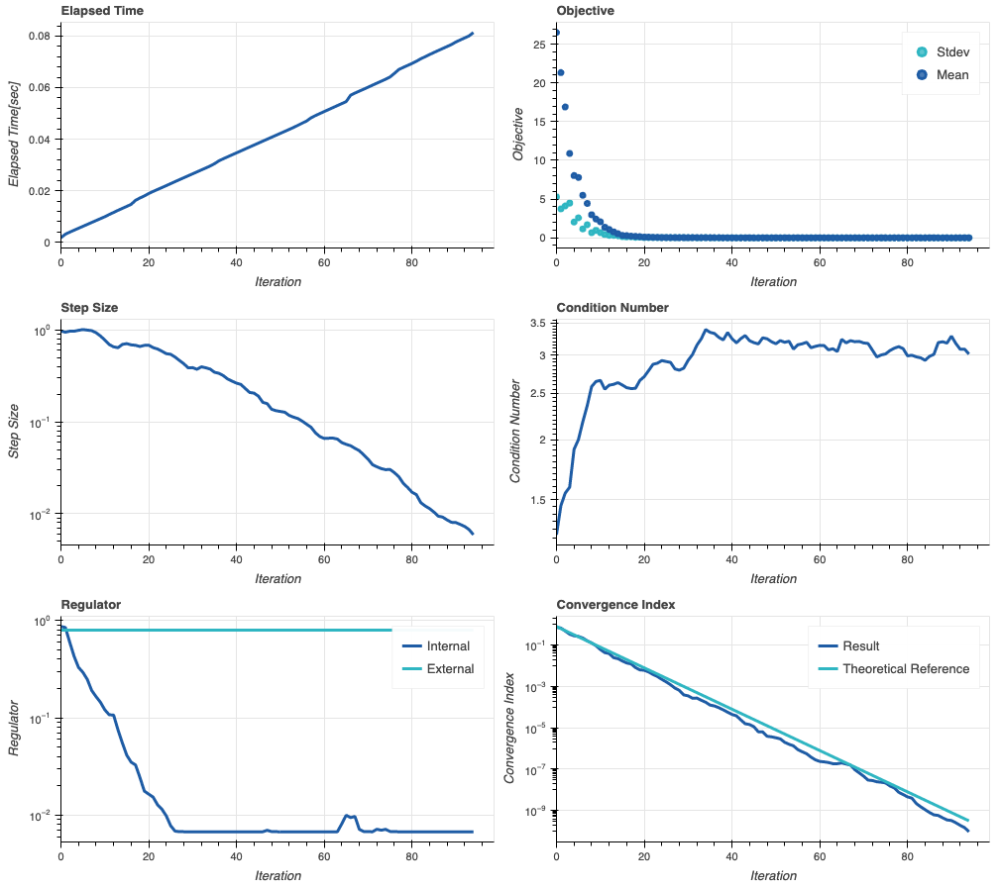

# RegCMA
**RegCMA** is a Python implementation of Regulated Evolution Strategies [1] with Covariance Matrix Adaption [2] for continuous "Black-Box" optimization problems. RegCMA is suitable for optimization in situations where the allowed number of iterations is limited such as hyper-parameter tuning in machine learning model and optimization algorithm, and it attempts to make the most of them to find good solutions. 

## Installation
```
pip install git+https://github.com/snowberryfield/regcma.git
```

## Regulated Evolution Strategies
**Regulated Evolution Strategies** *(hereinafter referred to as RES)* is a evolutionary algorithm framework to attempts to find reasonable solutions of following unconstrained minimization problems:

$$
(\mathrm{P}): \underset{x}{\mathrm{minimize}}\enspace f(x)
$$

where $x$ denotes $N$-dimensional decision variables, and $f:R^N \mapsto R$ denotes "Black-Box" objective function to be minimized. A RES-based algorithm should satisfy the following updating structure:

$$
\begin{aligned}
x^{p}(k) &= \mu(k) + \sqrt{\alpha(k) r(k)} y^{p}(k) \enspace (p\in\mathcal{P}), \\
S_{y}(k) &= \frac{1}{\lvert \mathcal{P}\rvert} \sum_{p\in\mathcal{P}} y^{p}(k)y^{p\top}(k), \\
T(k) &= \alpha(k) r(k) \mathrm{Tr}  C(k) \exp \left(\frac{\mathrm{Tr} S_{y}(k)}{\mathrm{Tr}  C(k)} - 1\right), \\
r(k+1) &= \left(\frac{T(k)}{\mathrm{Tr} C(k+1)} \right)^{1-\beta}r^{\beta}(k),
\end{aligned}
$$

where $k = 0,1,\dots$ denotes the iteration, $\mathcal{P} = \lbrace 1,\dots,\lvert \mathcal{P}\rvert\rbrace$ denotes the index set for samples, and $x^{p}(k) \in \mathbb{R}^{N}(p\in\mathcal{P})$ denote individual samples. Random vectors $y^{p}(k) \in \mathbb{R}^{N}(p\in\mathcal{P})$ are drawn from ${\cal N}(0,C(k))$. The distribution parameters $\mu(k) \in \mathbb{R}^{N}$ and $C(k) \in \mathbb{R}^{N \times N}$ can be updated in an arbitrary manner, meanwhile RegCMA employs the manner of CMA-ES[2]. The state $r(k)$ should be called *internal regulator*, which attenuates the influence of $C(k)$ in future. It is initialized by $r(0)=1$ and updated with the delay factor parameter $\beta \in (0,1)$. In contrast, the parameter $\alpha(k) \in\{0,1\}$ should be called *external regulator*, which controls convergence speed of the sample dispersion. The state $T(k)$ indicating the sample dispersion in the framework, is an intentional approximation of $\mathrm{Tr} S_{x}(k) =  \frac{1}{\lvert \mathcal{P}\rvert}\sum_{p\in\mathcal{P}} (x^{p}(k)-\mu(k))(x^{p}(k)-\mu(k))^{\top}$ to enable rigorous analysis. 

The RES framework provides the following theorem that states convergence of sample dispersion.

**Theorem 1 [1]**: Let ${\cal A}$ denote an RES-based algorithm. Suppose there exist constants $L_{\log \alpha}(k) \in \mathbb{R}$ and $L_{\log r} > 0$ such that $\log \alpha(k) \le L_{\log \alpha}(k) < +\infty \enspace  (\forall k\ge 0)$ and $\left\lvert \log  T(k) / \mathrm{Tr} C(k+1) \right\rvert \le L_{\log r} < +\infty \enspace (\forall k\ge 0)$. In addition, suppose $y^{p}(k) \enspace (k \ge 0, p\in\mathcal{P})$ be independent of each other. If ${\cal A}$ is designed so that 

$$
\lim_{k \to \infty} \frac{1}{\sqrt{k+1}} \sum_{\kappa=0}^{k} L_{\log \alpha}(\kappa) = -\infty,
$$

then 

$$
\lim_{k \to \infty} \Pr \left(T(k) \ge \varepsilon \right) = 0 \enspace (\forall \varepsilon > 0)
$$

holds. Also, as a byproduct of this theorem, we have the following estimator:

$$
\log T(k) \approx \sum_{\kappa=0}^{k}\log \alpha(\kappa) + \log \mathrm{Tr} C(0).
$$

With this estimator, we can design the value of $\alpha(k)$ with allowed maximum number iterations and target tolerance of $T(\simeq S_{x})$.

## Example

```python
# -*- coding: utf-8 -*-
import regcma
import numpy as np

# Define the objective function to be minimized.
def quadratic(x): return x.dot(x)

# Define the initial solution.
DIMENSION = 10
x0 = np.random.randn(DIMENSION)

option = {
    'iteration_max': 100,
    'initial_covariance': 1E0,
    'convergence_tolerance': 1E-10
}

result = regcma.solve(quadratic, x0, option, plot=True)
```

In the example above, RegCMA minimizes the objective function with regulating its sampling dispersion so that the convergence index (mean of diagonal components of the $S_{x}$) gradually reaches `1E-10` at iteration `100`. The following plot depicts the search trend. The chart of *Convergence Index* shows that actual convergence index tracks the theoretical reference.



## Options
Please refer [List of Options](options.md).

## License
**RegCMA** is distributed under [MIT license](https://opensource.org/licenses/MIT).

## References
- [1] Yuji Koguma : Regulated Evolution Strategies: A Framework of Evolutionary Algorithms with Stability Analysis Result, IEEJ Transactions on Electrical and Electronic Engineering, Vol.15, No.9, pp.1337-1349 (2020).
https://onlinelibrary.wiley.com/doi/abs/10.1002/tee.23201

- [2]  N.Hansen: The CMA Evolution Strategy: A Tutorial, arXiv:1604.00772 [cs.LG] (2016). 
https://arxiv.org/abs/1604.00772

